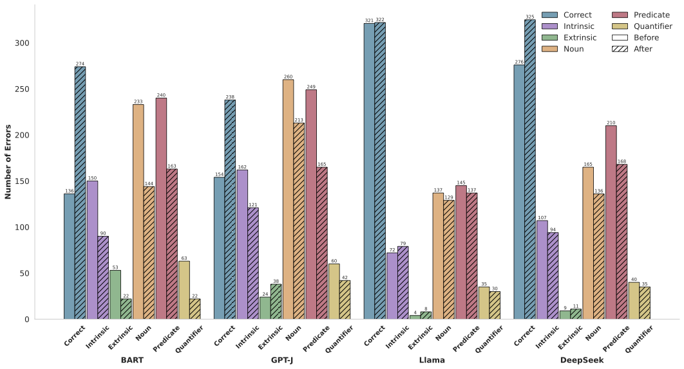
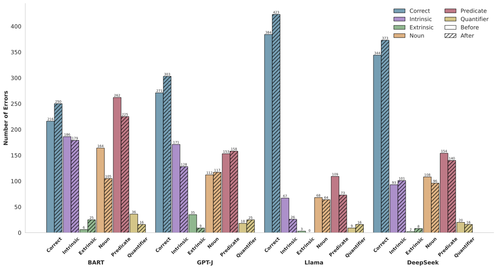
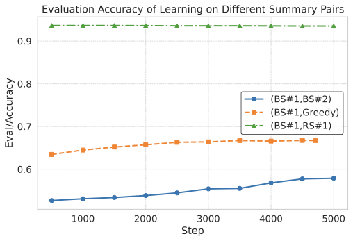

# Optimising Factual Consistency in Summarisation via Preference Learning from Multiple Imperfect Metrics

[](#)

Code repository for the EMNLP 2025 paper *Optimising Factual Consistency in Summarisation via Preference Learning from Multiple Imperfect Metrics* by Yuxuan Ye, Raul Santos-Rodriguez, and Edwin Simpson (University of Bristol).

---

> **Abstract:** Reinforcement learning with evaluation metrics as rewards is widely used to enhance specific capabilities of language models. However, for tasks such as factually consistent summarisation, existing metrics remain underdeveloped, limiting their effectiveness as signals for shaping model behaviour.While individual factuality metrics are unreliable, their combination can more effectively capture diverse factual errors. We leverage this insight to introduce an automated training pipeline that improves factual consistency in summaries by aggregating scores from different weak metrics. Our approach avoids the need for complex reward shaping by mapping scores to preferences and filtering out cases with high disagreement between metrics. For each source document, we generate lexically similar summary pairs by varying decoding strategies, enabling the model to learn from factual differences caused by subtle lexical differences. This approach constructs a high-quality preference dataset using only source documents.Experiments demonstrate consistent factuality gains across models, ranging from early encoder-decoder architectures to modern large language models, with smaller models reaching comparable factuality to larger ones.

---

## Overview

MultiMetric is a fully automated training pipeline that improves factual consistency in text summarisation **without requiring any human annotations or reference summaries**. It works by:

1. Generating **lexically similar summary pairs** by varying decoding strategies (e.g., beam search top-1 vs. top-2 candidates), so the model learns from subtle factual differences rather than stylistic variation.
2. Scoring both summaries with an **ensemble of imperfect factuality metrics** (SBERTScore + SummaC).
3. Keeping only pairs where **all metrics agree** on which summary is more factual, producing clean preference labels.
4. Fine-tuning the summariser with **Direct Preference Optimization (DPO)** using these labels.

The method generalises across model architectures and scales — from BART to GPT-J, LLaMA, and DeepSeek — and consistently boosts factuality, often bringing smaller models to performance levels comparable to much larger ones.


---

## Key Results

### Factuality improvements across models (XSUM)

| Model | SFT | MPO | Ours (AlignScore) |
|:------|:---:|:---:|:-----------------:|
| BART  | 61.9 | 62.0 | **86.6** |
| GPT-J | 59.7 | 53.5 | **75.8** |
| LLaMA | 86.1 | 79.8 | **88.7** |
| DeepSeek | 82.5 | 81.3 | **83.2** |

### Error frequency analysis

Training with MultiMetric reduces key error types (Noun, Predicate, Quantifier) across datasets and models.

|  |  |
|:---:|:---:|
| Error frequencies on XSUM | Error frequencies on TL;DR |

### Training dynamics


*Evaluation accuracies over pairwise labels during DPO training (BART on XSUM).*

---

## File Overview

```
MultiMetric/
├── figs/                              # Paper figures
```

### Core pipeline scripts

| File | Purpose |
|------|---------|
| `sampling_with_different_strategy.py` | Generate lexically similar summary pairs with varied decoding |
| `score_dataset.py` | Score summaries with SBERTScore + SummaC |
| `sbert_score.py` | SBERTScore implementation |
| `merge_dataset.py` | Merge scored pairs, remove conflicting labels |
| `rl.py` | DPO / RL training (LLaMA, GPT-J, DeepSeek) |
| `rl-bart.py` | DPO / RL training (BART) |
| `generate_with_pipeline.py` | Generate summaries via transformers pipeline |
| `llama_generate_with_pipeline.py` | LLaMA-specific generation (pipeline API) |
| `gpt-j-sft.py` | Supervised fine-tuning for GPT-J |
| `post_process.py` | Extract and format generated summaries |
| `post_process_reasoning_output.py` | Parse chain-of-thought outputs (DeepSeek) |
| `resave_final_checkpoint.py` | Re-save trained model checkpoints |
| `check_bnb_install.py` | Verify bitsandbytes installation |

### Shell scripts

`run-*.sh` — Run each step with example arguments  
`slurm-run-*.sh` — Run steps on Slurm-managed clusters

### Configuration & data

| File | Purpose |
|------|---------|
| `env_config_on_isambard.md` | Environment setup guide (Isambard cluster) |
| `run-singularity-w-fakeroot.txt` | Singularity container setup |
| `completions/gpt-j-6b-tldr-rlhf/` | Example generated completions |

---

## Getting Started

### Environment

Key dependencies:
- Python 3.10+, CUDA-compatible GPU
- PyTorch (`pip install torch --index-url https://download.pytorch.org/whl/cu126`)
- `transformers`, `datasets`, `accelerate`
- `bitsandbytes` (may need local compilation — see [env_config_on_isambard.md](env_config_on_isambard.md))
- `summac`, `sentence-transformers`

For a full walkthrough, see [env_config_on_isambard.md](env_config_on_isambard.md) and [run-singularity-w-fakeroot.txt](run-singularity-w-fakeroot.txt).

### Pipeline overview

The pipeline runs in four stages:

**1. Generate summary pairs**

`sampling_with_different_strategy.py` generates lexically similar summary pairs by varying decoding strategies (e.g., beam search #1 vs #2, or beam search vs greedy).

```bash
bash run-sampling_with_different_strategy.sh
```

For LLaMA / DeepSeek models:
```bash
bash run-llama_generate_with_pipeline.sh
```

**2. Score and label**

`score_dataset.py` scores each summary with SBERTScore + SummaC. Only pairs where metrics agree on ranking are retained.

```bash
bash run-score_dataset.sh
```

**3. Merge and filter**

`merge_dataset.py` merges scored pairs from different runs and removes conflicting labels.

```bash
bash run-merge_dataset.sh
```

**4. Train with DPO/RL**

`rl.py` (LLaMA, GPT-J, DeepSeek) or `rl-bart.py` (BART) performs Direct Preference Optimization.

```bash
bash run-rl-bart.sh    # for BART
bash run-rl.sh         # for LLaMA / GPT-J / DeepSeek
```

### Reproducing paper results

1. **SFT** (for GPT-J only): `bash run-gpt-j-sft.sh`
2. **Generate pairs**: `bash run-sampling_with_different_strategy.sh`
3. **Score**: `bash run-score_dataset.sh`
4. **Merge & filter**: `bash run-merge_dataset.sh`
5. **Train**: `bash run-rl-bart.sh` or `bash run-rl.sh`
6. **Post-process**: `bash run-post_process.sh`

---

## Citation

If you find this work useful for your research, please cite:

```bibtex
@inproceedings{ye-etal-2025-optimising,
    title = "Optimising Factual Consistency in Summarisation via Preference Learning from Multiple Imperfect Metrics",
    author = "Ye, Yuxuan  and
      Santos-Rodriguez, Raul  and
      Simpson, Edwin",
    editor = "Christodoulopoulos, Christos  and
      Chakraborty, Tanmoy  and
      Rose, Carolyn  and
      Peng, Violet",
    booktitle = "Findings of the Association for Computational Linguistics: EMNLP 2025",
    month = nov,
    year = "2025",
    address = "Suzhou, China",
    publisher = "Association for Computational Linguistics",
    url = "https://aclanthology.org/2025.findings-emnlp.940/",
    doi = "10.18653/v1/2025.findings-emnlp.940",
    pages = "17342--17355",
    ISBN = "979-8-89176-335-7",
}
```
